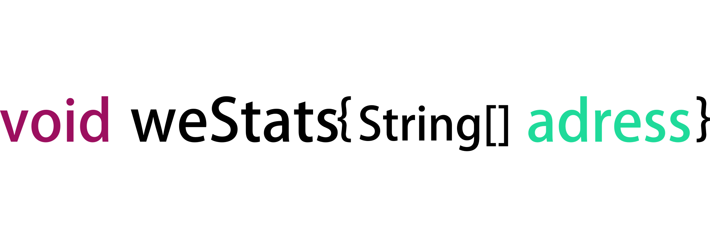

WeSTATS
==============
together. Keyword Pitch Statistics.

Why
==============
Nowadays, the rate of reflection is very high in any exam. For example, TOEIC only evaluates business English, frequent spoken words are frequently used. There are many spoken wordbooks already on the market. But I think it would be good to check it yourself.

How to use
==============

Multiple PDF files can be input.

License
==============
We used Apache's PDFBox. So you get an Apache 2.0 license.